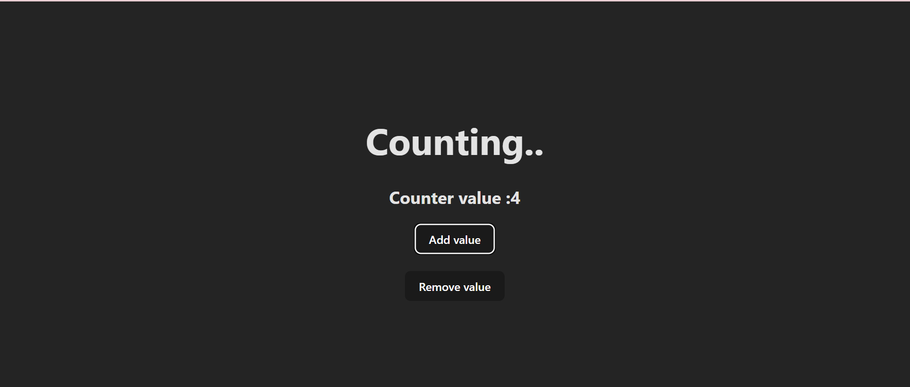
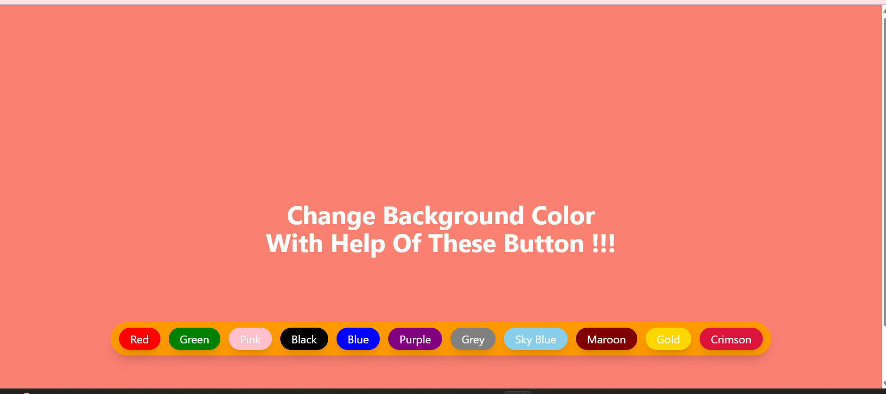

# 🖌️ BgColor and Counter 

A lightweight, modern React project bootstrapped with **Vite** and styled using **TailwindCSS**.
A simple counter application built using **React 19**, **Vite 7**, and styled with **TailwindCSS 4**. Includes ESLint integration for clean and maintainable code.
---

## 🚀 Features of counter 

- Increment and decrement counter functionality
- Responsive UI with TailwindCSS
- Fast refresh with Vite HMR
- Linting powered by ESLint and React Hooks plugin

---

## 🚀 Features of bgColor
-  **One-Click Action** – Easily trigger color changes via buttons.
- **State Management** – Uses React's `useState` hook.
-  **Fast Development** – Powered by Vite for blazing speed.
- **TailwindCSS UI** – Beautiful and responsive layout.

---
## 🛠 Tech Stack
- **React 19**
- **Vite 7**
- **TailwindCSS 4**
- **ESLint** (with React hooks and Vite refresh plugins)

---
 
## Screeenshot

